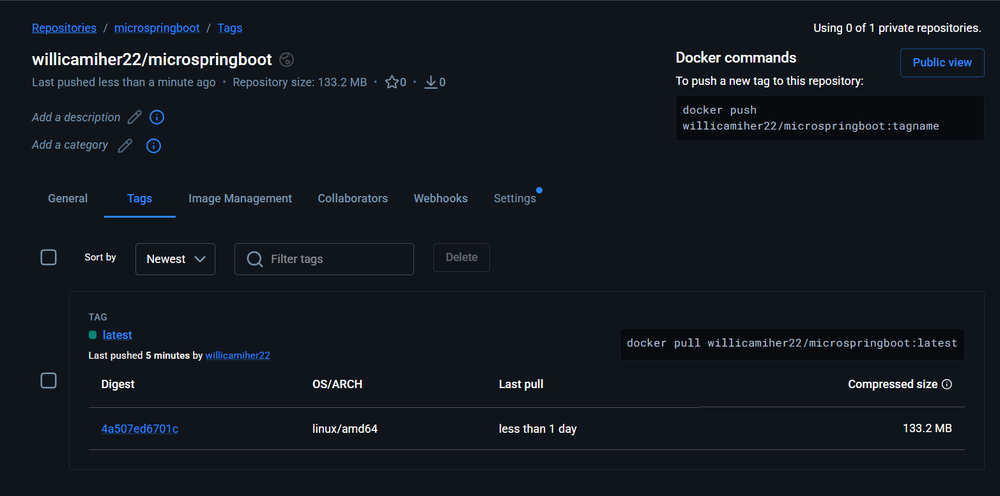
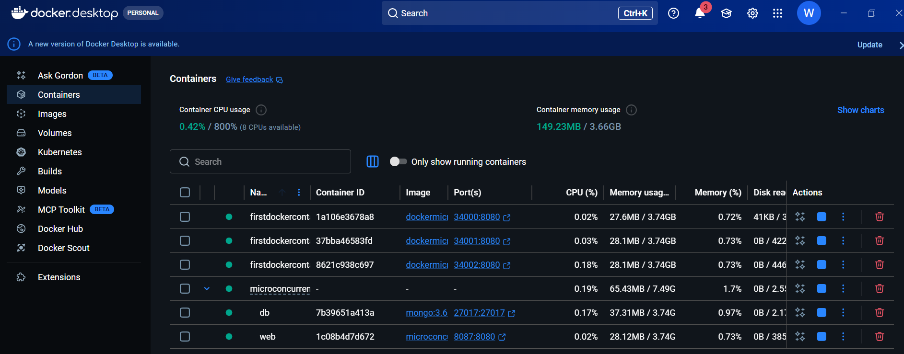
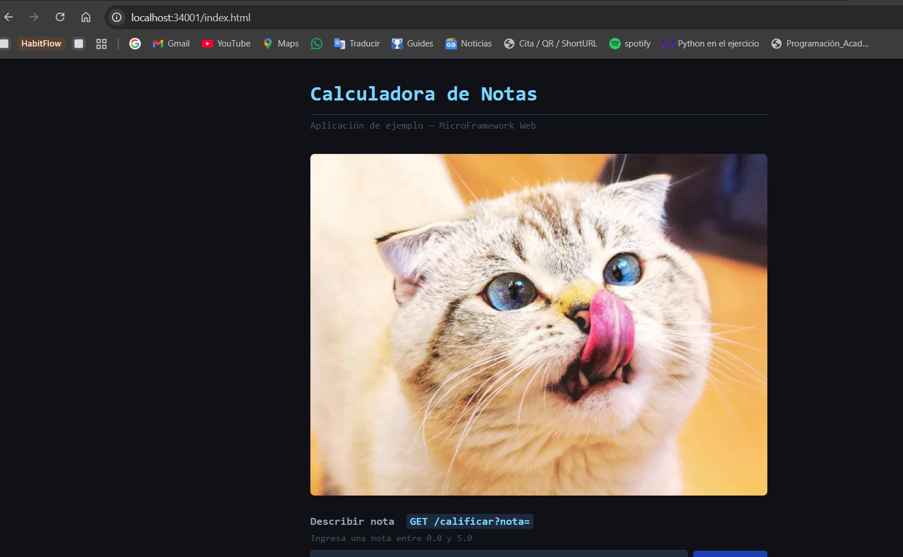
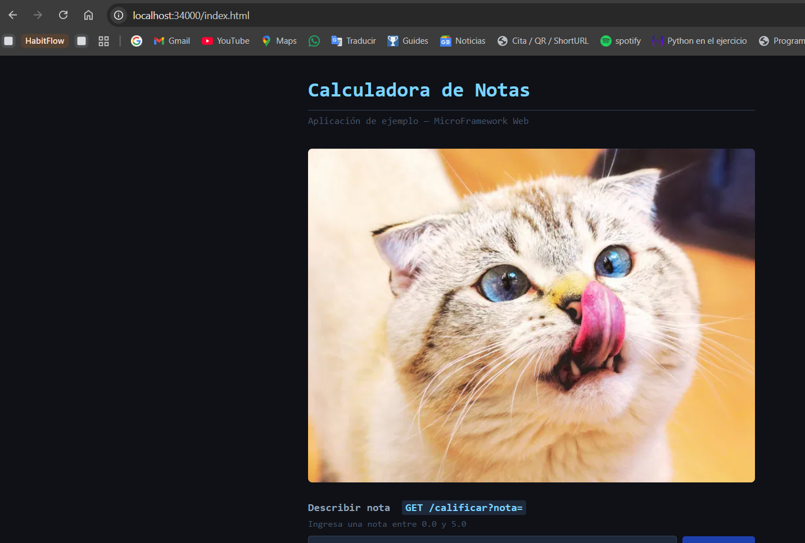
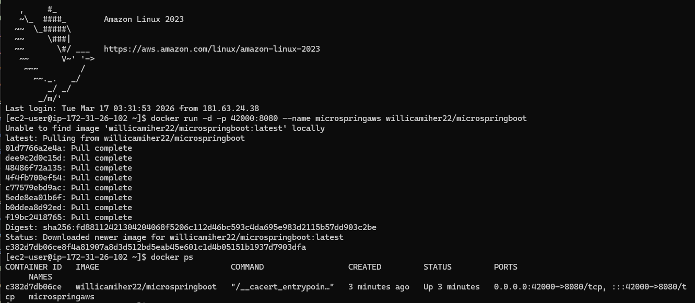
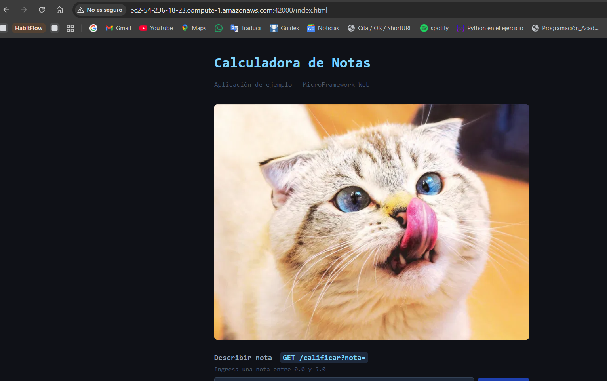

# MicroConcurrentSpring

Framework web minimalista inspirado en Spring MVC, implementado desde cero en Java puro usando **reflexión** y **anotaciones**. El servidor maneja peticiones concurrentes mediante un pool de hilos y puede desplegarse localmente o en la nube vía Docker.

---

## Tabla de contenidos

- [Resumen del proyecto](#resumen-del-proyecto)
- [Arquitectura](#arquitectura)
- [Diseño de clases](#diseño-de-clases)
- [Endpoints disponibles](#endpoints-disponibles)
- [Cómo ejecutar localmente](#cómo-ejecutar-localmente)
- [Despliegue con Docker](#despliegue-con-docker)
- [Despliegue en AWS](#despliegue-en-aws)
- [Evidencia de pruebas](#evidencia-de-pruebas)

---

## Resumen del proyecto

MicroConcurrentSpring es un proyecto educativo que replica el comportamiento básico de Spring MVC **sin depender de Spring**. Implementa:

- Un sistema de **anotaciones custom** (`@RestController`, `@GetMapping`, `@RequestParam`) con la misma semántica que Spring.
- Un **servidor HTTP** construido sobre `ServerSocket` que enruta peticiones GET usando reflexión.
- **Auto-descubrimiento** de controladores: el bootstrap escanea el classpath en tiempo de ejecución y registra automáticamente todas las clases anotadas con `@RestController`.
- **Manejo concurrente** de peticiones mediante `ExecutorService` con un pool de hilos dinámico (`newCachedThreadPool`).
- **Apagado elegante** (graceful shutdown): un shutdown hook espera hasta 30 segundos a que los requests en curso terminen antes de cerrar el servidor.
- Servicio de **archivos estáticos** (HTML, CSS, JS, imágenes) desde `src/main/resources/webroot/`.

---

## Arquitectura

```
┌─────────────────────────────────────────────────────────┐
│                     MicroSpringBoot                     │
│  (Bootstrap: escanea classpath → registra controllers)  │
└─────────────────────────┬───────────────────────────────┘
                          │ registerController(Class<?>)
                          ▼
┌─────────────────────────────────────────────────────────┐
│                       HttpServer                        │
│                                                         │
│  ServerSocket (port 8080)                               │
│       │                                                 │
│       ▼  accept()                                       │
│  ExecutorService ──► handleRequest(Socket) [por hilo]   │
│                                                         │
│  routeMap:    URI  ──► Method   (reflexión)             │
│  instanceMap: URI  ──► Object   (instancia controller)  │
│                                                         │
│  1. Servir archivo estático desde /webroot              │
│  2. Buscar ruta en routeMap                             │
│  3. Resolver @RequestParam del query string             │
│  4. Invocar método vía Method.invoke()                  │
└─────────────┬────────────────────────────────┬──────────┘
              │                                │
              ▼                                ▼
  ┌───────────────────────┐      ┌─────────────────────────┐
  │   Controllers (POJOs) │      │   Archivos estáticos    │
  │  @RestController      │      │   webroot/index.html    │
  │  @GetMapping          │      │   webroot/app.js        │
  │  @RequestParam        │      │   webroot/style.css     │
  └──────────┬────────────┘      └─────────────────────────┘
             │
             ▼
  ┌───────────────────────┐
  │       Services        │
  │   (lógica de negocio) │
  └───────────────────────┘
```

### Flujo de una petición

```
Cliente HTTP
    │
    │  GET /calificar?nota=4.5
    ▼
ServerSocket.accept()
    │
    ▼
ExecutorService.submit(handleRequest)   ← hilo del pool
    │
    ├─ ¿Existe /webroot/calificar?  → No
    │
    ├─ ¿Existe ruta en routeMap?    → Sí
    │
    ▼
invokeController("/calificar", "nota=4.5")
    │
    ├─ Obtener Method via reflexión
    ├─ Resolver @RequestParam("nota") → "4.5"
    ├─ Method.invoke(controllerInstance, "4.5")
    │
    ▼
GradeController.calificar("4.5")
    │
    ▼
GradeService.calificarNota("4.5")  →  "Nota 4.50: Excelente"
    │
    ▼
HTTP/1.1 200 OK → Cliente
```

---

## Diseño de clases

```
co.edu.escuelaing
│
├── annotations/
│   ├── RestController      @interface (ElementType.TYPE)
│   │                       Marca una clase como controlador HTTP.
│   │                       Retention: RUNTIME
│   │
│   ├── GetMapping          @interface (ElementType.METHOD)
│   │                       value(): ruta URI del endpoint.
│   │                       Retention: RUNTIME
│   │
│   └── RequestParam        @interface (ElementType.PARAMETER)
│                           value(): nombre del query param.
│                           defaultValue(): valor por defecto.
│                           Retention: RUNTIME
│
├── server/
│   └── HttpServer
│       ├── routeMap:    Map<String, Method>   URI → método
│       ├── instanceMap: Map<String, Object>   URI → instancia
│       ├── registerController(Class<?>)       lee anotaciones via reflexión
│       ├── start()                            loop concurrente con ExecutorService
│       ├── handleRequest(Socket)              parsea HTTP y despacha
│       ├── invokeController(uri, query)       invoca via Method.invoke()
│       ├── resolveParams(Parameter[], query)  resuelve @RequestParam
│       ├── convertToType(String, Class<?>)    convierte String → int/double/boolean/…
│       └── serveStaticFile(uri, …)            sirve archivos de /webroot
│
├── MicroSpringBoot                            Bootstrap principal
│   ├── main(String[])                         punto de entrada
│   ├── findControllers()                      escanea classpath
│   └── scanDirectory(File, String, List)      recursión sobre .class files
│
├── FirstWebService        @RestController
│   ├── GET /v1            → "Greetings from MicroSpring!"
│   └── GET /hello         → "Hello World!"
│
├── GreetingController     @RestController
│   └── GET /greeting      ?name=X  → "Hello, X!"
│
├── GradeController        @RestController
│   ├── GET /calificar     ?nota=X   → delega a GradeService
│   ├── GET /promedio      ?notas=X,Y,Z → delega a GradeService
│   └── GET /aprobo        ?nota=X   → delega a GradeService
│
└── GradeService           (sin anotaciones, POJO puro)
    ├── calificarNota(String)     → Excelente / Sobresaliente / Aprobado / Reprobado
    ├── calcularPromedio(String)  → promedio de lista separada por comas
    └── aprobo(String)            → "Sí, aprobó" / "No, reprobó"
```

### Conversión de tipos soportada en `@RequestParam`

| Tipo Java     | Ejemplo query param |
|---------------|---------------------|
| `String`      | `?name=Carlos`      |
| `int`/`Integer` | `?edad=25`        |
| `double`/`Double` | `?nota=4.5`    |
| `long`/`Long` | `?id=123456789`     |
| `boolean`/`Boolean` | `?activo=true` |

---

## Endpoints disponibles

| Método | URI           | Query params             | Ejemplo de respuesta                  |
|--------|---------------|--------------------------|---------------------------------------|
| GET    | `/v1`         | —                        | `Greetings from MicroSpring!`         |
| GET    | `/hello`      | —                        | `Hello World!`                        |
| GET    | `/greeting`   | `name` (default: World)  | `Hello, Carlos!`                      |
| GET    | `/calificar`  | `nota` (0–5)             | `Nota 4.50: Excelente`                |
| GET    | `/promedio`   | `notas` (CSV)            | `Promedio: 3.83`                      |
| GET    | `/aprobo`     | `nota` (0–5)             | `Si, aprobo con 3.50`                 |
| GET    | `/index.html` | —                        | UI web (Calculadora de Notas)         |

---

## Cómo ejecutar localmente

### Prerrequisitos

- Java 17+ (o 25, según la imagen Docker)
- Maven 3.x

### Compilar y ejecutar

```bash
# Compilar
mvn clean compile

# Ejecutar (auto-descubre todos los @RestController)
mvn exec:java -Dexec.mainClass="co.edu.escuelaing.MicroSpringBoot"

# Ejecutar con un controlador específico
mvn exec:java -Dexec.mainClass="co.edu.escuelaing.MicroSpringBoot" \
              -Dexec.args="co.edu.escuelaing.FirstWebService"
```

El servidor queda disponible en `http://localhost:8080`.

---

## Despliegue con Docker

### 1. Construir la imagen local

```bash
docker build -t microspringboot .
```

El `Dockerfile` usa una **build multi-stage**:

```
Stage 1 (build):  eclipse-temurin:25-jdk
  └─ Instala Maven, compila el proyecto → target/classes/

Stage 2 (runtime): eclipse-temurin:25-jdk
  └─ Copia solo las clases compiladas y el webroot
  └─ CMD: java -cp ./classes co.edu.escuelaing.MicroSpringBoot
```

### 2. Ejecutar con Docker Compose

```bash
docker-compose up
```

Levanta dos servicios:

| Servicio | Puerto host | Puerto contenedor | Descripción          |
|----------|-------------|-------------------|----------------------|
| `web`    | `8087`      | `8080`            | Servidor HTTP        |
| `db`     | `27017`     | `27017`           | MongoDB 3.6.1        |

Acceder en: `http://localhost:8087`

### 3. Publicar imagen en Docker Hub

```bash
# Etiquetar la imagen
docker tag microspringboot willicamiher22/microspringboot:latest

# Autenticarse
docker login

# Publicar
docker push willicamiher22/microspringboot:latest
```

La imagen publicada está disponible en Docker Hub como `willicamiher22/microspringboot`.

---

## Despliegue en AWS

### Prerrequisitos

- Instancia EC2 con Amazon Linux 2023
- Docker instalado en la instancia
- Puerto abierto en el Security Group (en la prueba se usó el **42000**)

### Pasos

```bash
# 1. Conectarse a la instancia EC2 via SSH

# 2. Descargar y ejecutar la imagen desde Docker Hub
docker run -d -p 42000:8080 --name microspringaws willicamiher22/microspringboot

# 3. Verificar que el contenedor está corriendo
docker ps
```

La aplicación queda disponible en `http://<IP-PUBLICA-EC2>:42000`.

---

## Evidencia de pruebas

### Imagen publicada en Docker Hub



Imagen `willicamiher22/microspringboot:latest` publicada (133.2 MB, linux/amd64).

---

### Contenedores corriendo localmente (Docker Desktop)



Docker Desktop muestra los servicios `web` y `db` levantados mediante `docker-compose up`.

---

### Aplicación funcionando en Docker local




La UI de la **Calculadora de Notas** accesible en `http://localhost:34000/index.html` sirviendo correctamente el frontend estático y el endpoint `/calificar`.

---

### Despliegue en AWS EC2



Descarga automática de la imagen desde Docker Hub y ejecución en la instancia EC2 (Amazon Linux 2023). El contenedor `microspringaws` queda activo en el puerto **42000**.



La aplicación accesible desde el navegador apuntando a la IP pública de la instancia EC2 en el puerto 42000.

---

## Autor

William Camilo Hernandez Deaza
Escuela Colombiana de Ingeniería Julio Garavito
Transformaciones Digitales — 9.° semestre
